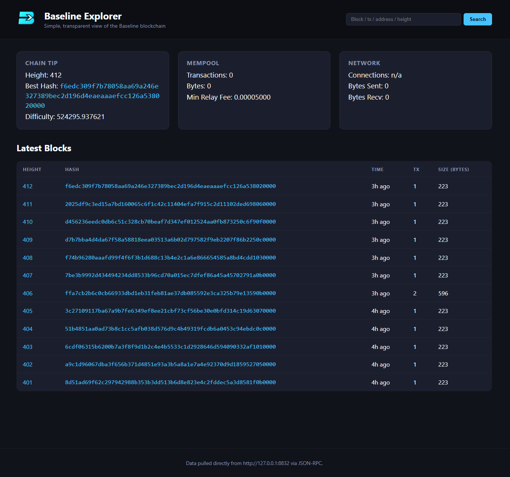

## Baseline Explorer



A lightweight Flask UI that hits a local Baseline node via JSON-RPC to show:

- Latest blocks, per-block details, and live mempool stats
- Transaction pages (with decoded inputs/outputs and fees)
- Address balance/history/UTXO views plus a universal search box

### Quick start

1. Ensure a Baseline node is running on `127.0.0.1:8832` with RPC user/pass set in `config.json`.
2. Install deps (one-time): `python -m pip install -r requirements.txt`
3. Launch the explorer from this folder:
   ```bash
   python app.py
   ```
4. Open http://127.0.0.1:5000 to browse your chain.

Update `config.json` if your node uses different RPC credentials/host.
